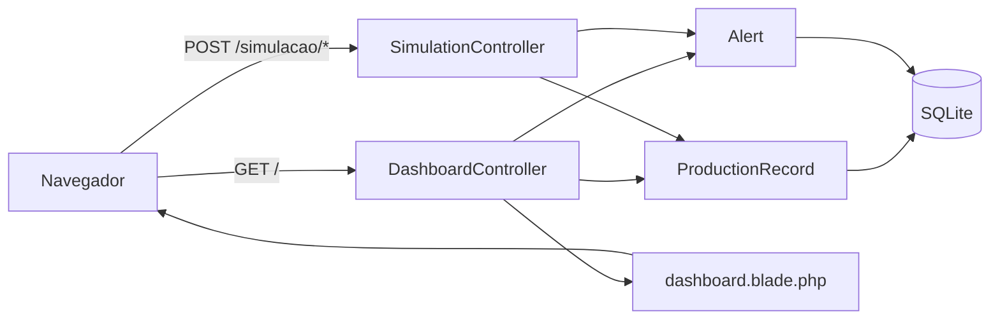

# Dashboard Posto 2 - Monitoramento IoT


Protótipo web desenvolvido no SENAI para monitorar o
**Posto 2 - Limpeza Externa** de uma linha de processamento de frangos. O
painel registra detecções simuladas, calcula indicadores de produção e permite
gerar e resolver alertas operacionais.

> [!IMPORTANT]
> O estado atual do projeto simula as leituras no servidor. O fluxo com sensor
> HC-SR04, Arduino e Wi-Fi é a arquitetura proposta, mas ainda não existe
> integração real com hardware, MQTT, comunicação serial ou outro protocolo
> IoT.

## Funcionalidades

- Dashboard responsivo para desktop e dispositivos móveis.
- Contagem total processada e produção acumulada no dia.
- Taxa média de produção calculada com os registros dos últimos cinco minutos.
- Histórico com as 20 leituras mais recentes.
- Simulação de detecções entre 1 e 3 unidades.
- Geração de alertas de parada da esteira ou baixa produtividade.
- Resolução de alertas pendentes sem excluir seu histórico.
- Atualização automática dos indicadores a cada 10 segundos.
- Feedback visual das operações por notificações toast.
- Proteção CSRF e limite de 30 requisições por minuto nas rotas de simulação.

## Arquitetura

O projeto segue uma estrutura MVC simples do Laravel:



Fluxo IoT representado visualmente no painel:

```text
Sensor HC-SR04 -> Arduino Uno -> Wi-Fi -> Dashboard
```

Esse segundo fluxo ainda não está conectado ao backend. As detecções usadas
pelo dashboard são geradas por `SimulationController`.

## Indicadores

| Indicador | Cálculo |
|---|---|
| Total processado | Soma de `chicken_count` de todos os registros |
| Produção hoje | Soma dos registros detectados na data atual do servidor |
| Taxa média | Soma das detecções dos últimos 5 minutos dividida por 5 |
| Alertas ativos | Quantidade de alertas com `resolved = false` |

## Tecnologias

### Backend

- PHP 8.3 ou superior
- Laravel 13
- Eloquent ORM
- SQLite
- PHPUnit 12

### Frontend

- Blade
- Tailwind CSS via CDN
- JavaScript puro
- Font Awesome
- Google Fonts

O repositório também possui Vite e Tailwind CSS 4 configurados para
`resources/css/app.css` e `resources/js/app.js`. Entretanto, a view atual do
dashboard usa Tailwind via CDN e mantém seus estilos e scripts diretamente em
`dashboard.blade.php`.

## Requisitos

- Git
- PHP 8.3 ou superior
- Composer
- Extensões PHP `pdo_sqlite` e `sqlite3`
- Node.js e npm apenas para trabalhar com os assets Vite
- Acesso à internet para carregar Tailwind CDN, Google Fonts e Font Awesome

Confira se os requisitos principais estão disponíveis:

```bash
php --version
composer --version
php -m
```

## Instalação

Clone o repositório:

```bash
git clone https://github.com/BernardoDiniz-1898/dashboard-posto2.git
cd dashboard-posto2
```

Instale as dependências PHP:

```bash
composer install
```

Crie o arquivo de ambiente e o banco SQLite. Os comandos PHP abaixo funcionam
em Windows, Linux e macOS:

```bash
php -r "file_exists('.env') || copy('.env.example', '.env');"
php -r "file_exists('database/database.sqlite') || touch('database/database.sqlite');"
```

Gere a chave da aplicação e prepare o banco:

```bash
php artisan key:generate
php artisan migrate --force
```

Para desenvolvimento local, recomenda-se ajustar estas opções no `.env`:

```dotenv
APP_ENV=local
APP_DEBUG=true
LOG_LEVEL=debug
```

Inicie o servidor:

```bash
php artisan serve
```

Acesse `http://localhost:8000`.

### Instalação automatizada

O projeto possui um script que instala as dependências, configura o Laravel,
executa as migrations e gera os assets. Crie primeiro o banco SQLite e depois
execute:

```bash
php -r "file_exists('database/database.sqlite') || touch('database/database.sqlite');"
composer run setup
```

### Assets frontend

Os assets Vite não são necessários para renderizar o dashboard atual. Para
preparar o pipeline frontend mesmo assim:

```bash
npm install --ignore-scripts
npm run build
```

Para executar servidor, fila, logs e Vite em paralelo:

```bash
composer run dev
```

O worker de filas e o Vite fazem parte do ambiente preparado pelo Laravel, mas
não são exigidos pelo fluxo atual do dashboard.

## Como usar

1. Abra `http://localhost:8000`.
2. Clique em **Simular Detecção** para registrar aleatoriamente de 1 a 3 unidades.
3. Confira a atualização dos indicadores e da tabela de leituras.
4. Clique em **Gerar Alerta** para criar um alerta operacional.
5. Use o botão de confirmação ao lado de um alerta para marcá-lo como resolvido.

Os dados são armazenados em `database/database.sqlite` e permanecem disponíveis
após reiniciar a aplicação.

## Rotas

| Método | Rota | Descrição | Resposta |
|---|---|---|---|
| `GET` | `/` | Renderiza o dashboard | HTML |
| `POST` | `/simulacao/detectar` | Registra uma detecção aleatória | JSON |
| `POST` | `/simulacao/alerta` | Gera um alerta aleatório | JSON |
| `POST` | `/simulacao/alerta/{alert}/resolver` | Resolve um alerta | JSON |
| `GET` | `/up` | Verifica a saúde da aplicação | HTTP |

As rotas `POST` pertencem ao grupo web, exigem um token CSRF válido e estão
limitadas pelo middleware `throttle:30,1`.

## Banco de dados

### `production_records`

| Campo | Tipo | Descrição |
|---|---|---|
| `id` | integer | Identificador do registro |
| `chicken_count` | integer | Quantidade detectada |
| `detected_at` | timestamp | Data e hora da detecção |
| `created_at` | timestamp | Data de criação |
| `updated_at` | timestamp | Data de atualização |

### `alerts`

| Campo | Tipo | Descrição |
|---|---|---|
| `id` | integer | Identificador do alerta |
| `type` | string | Tipo interno do alerta |
| `message` | string | Mensagem apresentada no painel |
| `resolved` | boolean | Indica se o alerta foi resolvido |
| `created_at` | timestamp | Data de criação |
| `updated_at` | timestamp | Data de atualização |

## Estrutura principal

```text
app/
├── Http/Controllers/
│   ├── DashboardController.php
│   └── SimulationController.php
└── Models/
    ├── Alert.php
    └── ProductionRecord.php

database/
├── migrations/
└── seeders/

resources/
├── css/app.css
├── js/app.js
└── views/
    └── dashboard.blade.php

routes/
└── web.php

tests/
├── Feature/
└── Unit/
```

## Testes

Execute a suíte com:

```bash
composer test
```

ou:

```bash
php artisan test
```

A cobertura atual contém apenas os testes iniciais do Laravel. Ainda faltam
testes específicos para cálculos dos indicadores, criação de detecções, geração
e resolução de alertas, rate limiting e atualização do dashboard.

## Limitações conhecidas

- Não existe comunicação real com Arduino ou sensor HC-SR04.
- As rotas não possuem autenticação; CSRF e throttling são as proteções atuais.
- A atualização automática usa polling HTTP, não WebSocket, SSE ou MQTT.
- O status "Sistema operacional" exibido no cabeçalho é estático.
- O timezone da aplicação está configurado como UTC, enquanto o relógio do
  cabeçalho usa o horário local do navegador.
- A taxa média sempre divide a produção recente por cinco, mesmo quando existe
  menos de cinco minutos de dados.
- O dashboard depende de CDNs para estilos, fontes e ícones.
- Os testes ainda não cobrem os fluxos principais da aplicação.

## Próximos passos

- Criar um endpoint autenticado para receber leituras reais.
- Integrar o backend com MQTT ou outro protocolo apropriado ao dispositivo.
- Adicionar autenticação e autorização para operadores.
- Substituir o polling por WebSocket ou Server-Sent Events.
- Adicionar gráficos históricos e filtros por período.
- Implementar paginação e política de retenção dos registros.
- Cobrir controllers, indicadores e regras de alerta com testes automatizados.
- Migrar os estilos e scripts inline para o pipeline Vite.
- Adicionar índices para as consultas por `detected_at` e `resolved`.

## Autor

Desenvolvido por [Bernardo Diniz](https://github.com/BernardoDiniz-1898) como
atividade de IoT do SENAI.

## Licença

O `composer.json` declara o projeto sob a licença MIT. Adicione um arquivo
`LICENSE` ao repositório para formalizar os termos de distribuição.
